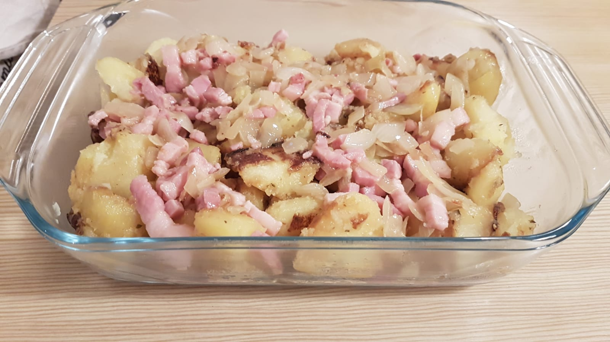
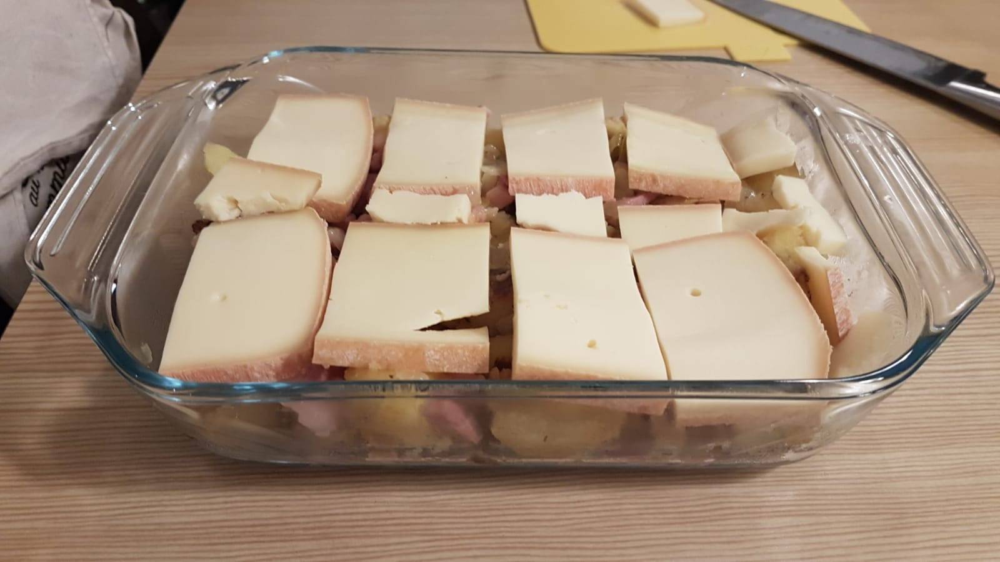
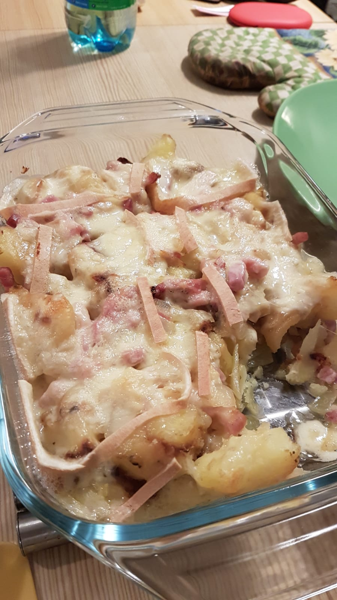

# Pela à la raclette (ou autre fromage :cheese:)

## Aperçu

## Quantité

* :raising_hand_man::raising_hand_man::raising_hand_man::raising_hand_man:

## Ingrédients

* 1 Oignon jaune
* 200g de lardons
* 8 Pommes de terre
* 200g de fromage à raclette
* Huile
* Aromates (Origan, Ail séché)

## Etapes (Cookeo)

* Peler et découper les pommes de terre en cubes
* Emincer l'oignon
* En mode `Dorer` faire revenir les oignons dans le cookeo
* Puis ajouter les lardons
* Réserver les lardons + oignons
* En mode `Dorer`,  mettre un fond d'huile, puis ajouter les pommes de terre.
  * Laisser mijoter 10 minutes
* Ajouter 150mL d'eau + aromates
* Passer en mode `Sous pression` pendant 4 minutes
* S'il reste de l'eau, revenir en mode `Dorer` 
* Disposer les oignons/lardons au fond d'un plat à gratin
* Ajouter les pommes de terre
* Recouvrir le plat de fromage à raclette

## Etape (Sans cookeo)

* Peler et découper les pommes de terre en cubes
* Emincer l'oignon
* Faire dorer les oignons puis les déglacer à l'eau
* Ajouter les lardons 
* Réserver les lardons et oignons
* Faire dorer les pommes de terre à la poele pour avoir des pommes de terre sautées
* Disposer les oignons/lardons au fond d'un plat à gratin
* Ajouter les pommes de terre
* Recouvrir le plat de fromage à raclette

## Cuisson 

* T° : 200°C
* Durée:  10/12 minutes (four chaleur tournante) + 3/4 minutes (four grill)

**Bon appétit !**